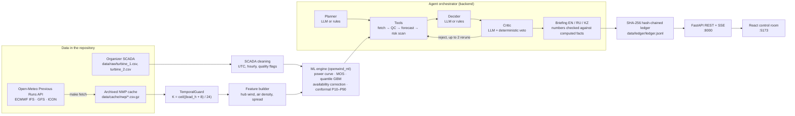

# OpenWind: agentic wind-farm power forecasting
**HackAlem AI 2026 · Case: Agentic AI for Wind Farm Generation Forecasting (ВЭС).**

OpenWind is an AI agent that produces **hourly probabilistic (P10/P50/P90) generation forecasts 24–48 h ahead** for a two-turbine wind farm
in the Shelek corridor (Almaty region). It replays the February 2026 test period day by day, selecting **archived forecast offsets under a documented availability assumption** (provider release times are not verified), checks its own output, writes dispatcher briefings in Kazakh, Russian and English, and seals
every published forecast in a tamper-evident hash-chained ledger.

> **Быстрый запуск для технической комиссии (3 команды, нужен только Docker):**
> ```bash
> git clone https://github.com/BAITC-Hacks/hack-3cc2878c-offscript.git && cd hack-3cc2878c-offscript
> cp .env.example .env
> docker compose up --build
> ```
> Откройте http://localhost:5173 (интерфейс) и http://localhost:8000/docs (API). Интернет, ключи API и обучение моделей не требуются:
> архив прогнозов погоды, обученные модели и результаты уже находятся в репозитории. Проверка основного сценария описана в разделе 9.

### README requirements checklist / Соответствие требованиям к README.

| Требование (HackAlem AI) | Section |
|---|---|
| Описание решения и его назначения | [1](#1-описание-решения--solution-and-purpose) |
| Описание архитектуры | [2](#2-архитектура--architecture) |
| Используемые технологии | [3](#3-технологии--technologies) |
| Системные требования | [4](#4-системные-требования--system-requirements) |
| Инструкции по установке | [5](#5-установка--installation) |
| Настройка, параметры окружения | [6](#6-настройка-и-переменные-окружения--configuration-and-environment-variables) |
| Инструкции по запуску | [7](#7-запуск--running) |
| Необходимые зависимости | [8](#8-зависимости--dependencies) |
| Порядок проверки основного сценария | [9](#9-проверка-основного-сценария--verifying-the-main-scenario) |

---

## 1. Описание решения / Solution and purpose.

**Problem.** Wind generation is variable. The grid operator and the farm need an hourly forecast for the next day, with an honest uncertainty
range, so they can plan balancing reserves and limit imbalance costs.

**What OpenWind does.** It forecasts the normalized output (0–1 of farm capacity) of the two-turbine farm (turbine coordinates 43.64515 N,
78.53560 E and 43.64320 N, 78.53883 E; farm point used for weather 43.6442 N, 78.5372 E):

The source column is **normalized active power on the line side**. Charts multiply that 0–1 quantity by 100: **100% means full assumed farm capacity**, not forecast confidence or a probability. P10/P50/P90 are power quantiles on the same scale; MW/MWh use the configurable 5 MW capacity assumption.

- **Forecast issues.** One forecast is issued at 00:00 local time (Asia/Almaty, UTC+5) on every day from 31 Jan to 27 Feb 2026, which is 28 issues.
- **Horizon.** Each issue covers the next 48 hours at hourly resolution. Leads 24–47 h are the **day-ahead product**, so the 28 issues cover every hour of 1–28 Feb 2026 (672 hours).
- **Archived-offset weather.** Weather comes from the Open-Meteo *Previous Runs* archive (ECMWF IFS 0.25°, NCEP GFS, DWD ICON). **TemporalGuard** selects fixed lead-time offsets using a configured 8-hour latency assumption; the API does not provide verified source release timestamps (see [Compliance](#compliance-with-archived-forecasts-only)).
- **The agent runs the cycle.** It plans, retrieves the archived weather, checks input quality, runs the ML model, scans risks, decides, has a critic audit the result (reruns are possible), writes a briefing and publishes the forecast to the ledger.
- **Deterministic fallback.** Without an LLM key, every LLM decision is replaced by a rule-based policy, so the project runs fully offline.

**How the case requirements are covered**

| Case requirement | Implementation | Where / how to check |
|---|---|---|
| Model built on the provided history (Mar 2023 – Jan 2026) | SCADA cleaning (UTC+6→UTC+5 clock change on 1 Mar 2024, hourly averaging, outage/stuck/icing flags) → empirical power curve (isotonic) → MOS wind correction → quantile gradient boosting → availability correction → conformal calibration of P10–P90 | `ml/openwind_ml/data.py`, `models.py`, `power_curve.py` |
| Weather forecasts from open sources, by the farm coordinates, as available at the forecast moment | Open-Meteo Previous Runs API, three NWP models; `previous_dayK` offsets chosen by the TemporalGuard rule; downloaded archive committed to `data/cache/nwp/` | `ml/openwind_ml/weather.py`, `temporal_guard.py`; `make fetch` |
| Hourly forecast for the next 24–48 h | 48 hourly rows per issue; day-ahead product = leads 24–47 | `data/outputs/submission/forecast_feb2026_dayahead.csv` (672 rows) |
| Agentic cycle: retrieve weather → prepare data → run model → hourly forecast → analyze → recalculate on new input | Orchestrator stages `PLAN → FETCH → QC → PREDICT → ANALYZE → DECIDE → CRITIC → RECALC → BRIEF → PUBLISH`, streamed live to the UI | `backend/app/agent/orchestrator.py`; UI tab *Agent console* |
| Replay as if in the past: 31 Jan → forecast, 1 Feb → new forecast, … through February | 28 sequential issues, each built only from data available at its issue time | `make test-run`, `make demo`; `data/outputs/forecasts/test/` |
| Archived forecast offsets, never actual weather | TemporalGuard checks the configured offset/latency policy inside every feature build; manifests hash cached chunks; new ledger blocks record an estimated NWP initialization time and explicit unverified-release status | `ml/tests/test_temporal_guard.py`; `POST /api/ledger/verify` |

**Validation (honest backtests, day-ahead leads 24–47 h, error normalized to farm capacity)**

Each validation model is trained only on data before the first issue of its period (SCADA after that point is removed before any fitting),
then replayed issue by issue exactly like the test period.

The OpenWind hybrid median is a fixed 50/50 blend of the quantile model and the MOS power curve. It is multiplied by an **availability factor**:
the share of hours in the 56-day calibration window before training ends in which the farm produced without outage, stuck-sensor or missing-data
flags. Before this correction the hybrid over-forecast by about 8–9 percentage points of capacity, because real output includes downtime. The
correction brought the hybrid bias down to +2.1 pp (Feb 2025) and +1.2 pp (winter).

Winter P10–P90 coverage is near its 80% target; February 2025 over-covers at 92.95%, a remaining calibration limitation.

| Held-out period | Hours | Model | NMAE | Bias | Skill vs persistence | P10–P90 coverage (target 80%) |
|---|---:|---|---:|---:|---:|---:|
| Feb 2025 (seasonal twin) | 667 | **OpenWind hybrid** | **20.29%** | +2.13 pp | +51.56% | 92.95% |
|  |  | MOS wind + power curve | 21.27% | +8.41 pp | +49.22% | 66.57% |
|  |  | Raw NWP wind + power curve | 21.48% | +8.58 pp | +48.73% | 65.67% |
|  |  | Climatology (month × hour) | 31.83% | +7.87 pp | +24.01% | 18.74% |
|  |  | Persistence (last observed power) | 41.89% | +1.28 pp | +0.00% | 28.79% |
| Winter 2025–26 (Nov–Jan) | 2,208 | **OpenWind hybrid** | **18.08%** | +1.25 pp | +51.90% | 79.62% |
|  |  | MOS wind + power curve | 18.12% | +6.76 pp | +51.78% | 52.45% |
|  |  | Raw NWP wind + power curve | 19.55% | +8.89 pp | +47.98% | 51.13% |
|  |  | Climatology (month × hour) | 33.15% | +5.19 pp | +11.80% | 16.80% |
|  |  | Persistence (last observed power) | 37.59% | -5.98 pp | +0.00% | 29.89% |

Numbers are copied from `data/outputs/metrics/val_feb2025.json` and `val_winter.json`; `make validate` regenerates them.
February 2026 actual generation was not provided, so no test-period accuracy is claimed.

---

## 2. Архитектура / Architecture



**Components**

| Folder | Role |
|---|---|
| `ml/openwind_ml/` | Forecasting engine (Python package): SCADA loading and cleaning (`data.py`), archived weather retrieval and cache (`weather.py`), no-lookahead rule (`temporal_guard.py`), features (`features.py`), models (`models.py`, `power_curve.py`), baselines, risk flags (`risk.py`), metrics, backtest/replay and submission writer (`backtest.py`), CLI (`cli.py`), stable JSON API for the backend (`api.py`) |
| `backend/app/` | FastAPI service: agent orchestrator (`agent/orchestrator.py`), rule-based policy (`agent/policy.py`), provider-neutral LLM adapter with structured JSON output and a response cache (`agent/llm.py`), briefing grounding check (`agent/briefing.py`), ledger (`ledger.py`), REST/SSE routers (`routers/`), batch replay (`batch.py`) |
| `frontend/src/` | React control room with 5 tabs: *Forecast*, *Agent console*, *Backtest & skill*, *Ledger*, *Economics* |
| `data/` | `raw/` organizer SCADA · `cache/nwp/` archived weather (27 files: 3 models × 9 date chunks) · `models/` trained bundles · `outputs/` forecasts, metrics, submission CSVs, agent runs, ledger payloads · `ledger/` hash chain · `llm_cache/` recorded LLM responses |
| `shared/mocks/` | JSON fixtures that mirror the API contract (used only with `VITE_USE_MOCKS=1` or `USE_ML_STUB=1`) |
| `docs/` | API contracts (`CONTRACTS.md`), design decisions (`ARCHITECTURE.md`), demo script, task text |

**Agent cycle (one issue).** The frontend calls `POST /api/agent/run`, then streams progress from `GET /api/agent/stream/{run_id}` (SSE):

1. `PLAN`: the planner chooses the weather models and the model variant.
2. `FETCH`: archived NWP is loaded through TemporalGuard, which records an **offset-derived estimated** weather-run time, not a provider-verified timestamp.
3. `QC`: input coverage and model-disagreement checks.
4. `PREDICT`: the ML engine computes 48 hourly P10/P50/P90 values.
5. `ANALYZE`: the risk scan flags ramps, low confidence, model disagreement, cut-out and icing.
6. `DECIDE`: ACCEPT / WIDEN / RERUN / ESCALATE.
7. `CRITIC`: an independent audit. If it rejects, the forecast is rerun (at most twice). A deterministic physical check can veto an LLM approval.
8. `RECALC`: each new replay issue compares its 24 overlapping target hours against the prior published issue, including comparable per-hour selected-NWP fingerprints and forecast MAE/max change. The new issue remains a `FORECAST` block. For the same issue, an automatic weather check publishes a `REVISION` only when selected input values changed; otherwise it ends without a new block. An operator can explicitly request a separately labelled manual uncertainty review.
9. `BRIEF`: dispatcher briefing in EN/RU/KZ. LLM text is rejected if it contains a number that is not in the computed facts.
10. `PUBLISH`: the forecast payload is written to an immutable file, and its SHA-256 goes into a new ledger block.

Numeric forecasts always come from Python, never from the LLM.

**Optional NWP watcher.** Set `NWP_WATCH_ENABLED=1` to poll the selected archived cache for a published issue. It compares the current selected-input fingerprint with the latest sealed version and automatically starts one keyless recalculation per changed version. Set `NWP_WATCH_ISSUE_DATE` to pin an issue, or leave it blank to watch the latest published issue in `NWP_WATCH_MODE`. This watches the local archive; it does **not** fetch live provider updates or prove when a source run was released. Refreshing the cache is a separate operation.

**REST API** (interactive documentation at http://localhost:8000/docs)

| Method and path | Purpose |
|---|---|
| `GET /api/health` | Service status and active configuration |
| `GET /api/meta` | Farm metadata, issue schedules, TemporalGuard rule |
| `GET /api/forecast?issue_date=2026-02-15&mode=test&variant=hybrid` | 48-hour forecast, risk flags, briefing, ledger integrity record when sealed |
| `POST /api/agent/run`, `POST /api/agent/recalc` | Start an agent run or a same-issue recalculation; `reason:"new_nwp"` requires changed selected inputs, while `reason:"manual_uncertainty_review"` explicitly publishes an operator review |
| `GET /api/agent/stream/{run_id}` | Live agent trace (Server-Sent Events) |
| `GET /api/agent/runs`, `GET /api/agent/runs/{run_id}` | Stored agent runs |
| `GET /api/backtest?mode=val_feb2025`, `GET /api/series?mode=val_winter` | Validation metrics and day-ahead series |
| `GET /api/ledger`, `POST /api/ledger/verify`, `POST /api/ledger/tamper-demo` | Ledger contents, verification, tamper-detection demo |
| `GET /api/economics?capacity_mw=5&price_kzt_mwh=15000` | Illustrative imbalance-cost comparison |

---

## 3. Технологии / Technologies

| Layer | Technologies (pinned versions) |
|---|---|
| ML | Python 3.11, pandas 2.2.3, NumPy 1.26.4, scikit-learn 1.5.2 (HistGradientBoosting with quantile loss, IsotonicRegression), joblib 1.4.2, requests 2.32.3 |
| Backend and agent | FastAPI 0.115.0, Uvicorn 0.30.6, Pydantic 2.9.2, sse-starlette 2.1.3, python-dotenv 1.0.1; optional LLM SDKs openai 3.19.0 / anthropic 1.8.0 |
| Frontend | React 18.3.1, TypeScript 5.6.3, Vite 5.4.11, Tailwind CSS 3.4.17, Recharts 2.13.3, lucide-react |
| Weather data | Open-Meteo Previous Runs API (ECMWF IFS 0.25°, NCEP GFS, DWD ICON), no API key required |
| Delivery | Docker Compose (python:3.11-slim, node:20-alpine build, nginx:1.27-alpine), pytest 8.3.3 |

---

## 4. Системные требования / System requirements

| | Docker option (recommended) | Local option |
|---|---|---|
| OS | Linux, macOS (Intel or Apple Silicon), Windows 10/11 with Docker Desktop | macOS or Linux (on Windows use WSL2 or Git Bash) |
| Software | Docker Engine 24+ with the Compose v2 plugin (`docker compose`), or Docker Desktop 4.x | Python **3.11** or newer, Node.js **20** (18+ works), npm, Git, `make` (optional) |
| RAM / disk | 4 GB RAM free; about 3 GB disk for images and build cache | 4 GB RAM; about 1.5 GB disk for the virtual environment and `node_modules` |
| Ports | 5173 (UI) and 8000 (API) must be free | 5173 and 8000 |
| Internet | Only for the first image build and package download. Running and verifying works offline. | Only for installing packages (and optionally `make fetch`) |

The repository itself is about 50 MB. It includes SCADA data, the weather archive, trained models and outputs, so no separate download is needed.

---

## 5. Установка / Installation

### Option A: Docker (recommended for the technical commission)

```bash
# 1. Get the code
git clone https://github.com/BAITC-Hacks/hack-3cc2878c-offscript.git
cd hack-3cc2878c-offscript

# 2. Create the environment file (defaults work as is: offline weather, real ML, no LLM key)
cp .env.example .env              # Windows PowerShell: Copy-Item .env.example .env

# 3. Build the images (first build takes a few minutes: it downloads base images and Python/Node packages)
docker compose build
```

### Option B: local installation (macOS / Linux)

```bash
# 1. Get the code
git clone https://github.com/BAITC-Hacks/hack-3cc2878c-offscript.git
cd hack-3cc2878c-offscript

# 2. Python environment (Python 3.11+)
python3.11 -m venv .venv
source .venv/bin/activate
pip install -r backend/requirements.txt    # also installs ml/requirements.txt
pip install -e ml                          # install the forecasting Python package

# 3. Frontend packages (Node.js 20)
cd frontend && npm ci && cd ..

# 4. Environment file
cp .env.example .env
```

Steps 2–3 can be replaced by `make setup PY=python3.11`.

---

## 6. Настройка и переменные окружения / Configuration and environment variables

All server settings are read from the **repository-root `.env`** file (template: `.env.example`). Docker Compose passes it to the backend,
and local runs load it automatically. The defaults need no changes.

| Variable | Default | Allowed values | Meaning |
|---|---|---|---|
| `LLM_PROVIDER` | `none` | `none`, `openai`, `openai_compatible`, `anthropic` | LLM used by the planner, decider, critic and briefing. `none` = deterministic rule-based agent (fully offline). |
| `LLM_MODEL` | empty | e.g. `gpt-4o-mini` | Model name for the chosen provider. If empty, the OpenAI adapter uses `gpt-4o-mini`. |
| `LLM_API_KEY` | empty | secret key | Put it **only** in the root `.env`; never commit it or place it in frontend variables. |
| `LLM_BASE_URL` | empty | URL | Endpoint for `openai_compatible` providers. |
| `WEATHER_OFFLINE` | `1` | `0` / `1` | `1` = use the committed weather archive (Docker Compose always sets `1`). `0` allows `make fetch` to download missing archive chunks from Open-Meteo. |
| `NWP_LATENCY_H` | `8` | integer hours | Assumed publication delay of a weather-model run, used by the TemporalGuard rule. If you change it, retrain (`make validate`, `make test-run`). |
| `FARM_CAPACITY_MW` | `5.0` | number | Assumed farm capacity, used only to convert normalized power to MW/MWh for display and economics. |
| `HUB_HEIGHT_M` | `100` | number | Informational only; the model uses a fixed 100 m hub height (`ml/openwind_ml/config.py`). |
| `DEMO_PACING` | `0` | `0` / `1` | `1` adds short pauses between agent stages so the live trace is easy to follow during a presentation. |
| `USE_ML_STUB` | `0` | `0` / `1` | `1` serves fixture data instead of the real ML engine (frontend development only). Keep `0`. |
| `NWP_WATCH_ENABLED` | `0` | `0` / `1` | Start an opt-in background poller for selected cached NWP inputs. No API key or external fetch is required. |
| `NWP_WATCH_POLL_SECONDS` | `60` | integer ≥ 5 | Interval between fingerprint checks. |
| `NWP_WATCH_MODE` | `test` | `test`, `val_feb2025`, `val_winter` | Replay schedule to watch. |
| `NWP_WATCH_ISSUE_DATE` | empty | issue date or empty | Pin a published issue; empty watches the latest published issue for the selected mode. |
| `NWP_WATCH_USE_LLM` | `0` | `0` / `1` | Whether watcher-triggered recalculation calls the LLM; keyless deterministic mode is the default. |

Frontend build-time variables (set in `docker-compose.yml` → `frontend.build.args`, or in the shell for `npm run dev`):

| Variable | Default | Meaning |
|---|---|---|
| `VITE_API_URL` | `http://127.0.0.1:8000` | Address of the API **as seen from the browser**. Change it if the UI is opened from another machine (see Troubleshooting). |
| `VITE_USE_MOCKS` | `0` | `1` shows bundled demo fixtures without a backend. |

**Optional LLM mode.** Set `LLM_PROVIDER=openai`, `LLM_MODEL=gpt-4o-mini` and `LLM_API_KEY=<key>` in `.env`, then restart the backend.
LLM responses are validated against Pydantic schemas and cached in `data/llm_cache/`. When `LLM_PROVIDER=openai` is set without a key, a
recorded response is replayed if the prompt matches exactly; otherwise the deterministic policy is used. The system never depends on the LLM
to produce numbers.

---

## 7. Запуск / Running

### Option A: Docker

```bash
docker compose up --build        # add -d to run in the background
```

The service is ready when the backend log shows `Uvicorn running on http://0.0.0.0:8000`. Then open:

- UI: **http://localhost:5173** (the header shows **Live API** when the UI is connected to the backend)
- API documentation: **http://localhost:8000/docs**

Stop with `Ctrl+C`, or `docker compose down`.

### Option B: local (two terminals, from the repository root)

```bash
# Terminal 1: API (run from the repository root)
source .venv/bin/activate
cd backend && PYTHONPATH=.:../ml uvicorn app.main:app --port 8000

# Terminal 2: UI (run from the repository root)
cd frontend && npm run dev -- --port 5173
```

### Reproducing the forecasting pipeline (optional; results are already in the repository)

The `make` targets are for the local option and run from the repository root with the virtual environment active. With Docker, run
the same steps inside the backend container, for example `docker compose exec backend python -m openwind_ml.cli validate --mode val_feb2025`,
`docker compose exec backend python -m openwind_ml.cli test-run`, `docker compose exec backend python -m app.batch --mode test`.

| Command | What it does | Output |
|---|---|---|
| `make validate` | Trains a model before each validation period (Feb 2025, winter 2025–26) and replays every issue (about 10 minutes on a laptop) | `data/models/val_*.joblib`, `data/outputs/metrics/*.json`, `data/outputs/forecasts/val_*/` |
| `make test-run` | Trains on all data up to 30 Jan 2026 and replays the 28 February issues | `data/models/test.joblib`, `data/outputs/submission/forecast_feb2026_dayahead.csv`, `forecast_feb2026_all_issues.csv` |
| `make demo` | Runs the agent (deterministic mode) over all 28 test issues and appends them to the ledger | `data/ledger/ledger.jsonl`, `data/outputs/agent_runs/` |
| `make tests` | Runs the ML and backend test suites | pytest summary |
| `WEATHER_OFFLINE=0 make fetch` | Downloads missing archived weather chunks from Open-Meteo (needs internet); existing committed chunks remain unchanged. | `data/cache/nwp/*.csv.gz` |

Agent runs and `make demo` append to `data/ledger/ledger.jsonl` in your checkout (Docker mounts `./data`). For repeatable judging, use a fresh clone or copy `data/` before a new batch; preserve audit records you want to keep.

---

## 8. Зависимости / Dependencies

- Python: `ml/requirements.txt` (pandas, NumPy, scikit-learn, requests, joblib, python-dotenv, pytest) and `backend/requirements.txt`
  (includes the ML list, plus FastAPI, Uvicorn, Pydantic, sse-starlette, httpx, openai, anthropic). All versions are pinned.
- ML package: `ml/pyproject.toml` (`pip install -e ml`, Python ≥ 3.10; the backend needs 3.11+).
- Frontend: `frontend/package.json` with the exact lockfile `frontend/package-lock.json` (`npm ci`).
- Data dependencies, all committed:
  - organizer SCADA in `data/raw/`;
  - archived weather in `data/cache/nwp/`;
  - trained models in `data/models/`;
  - outputs in `data/outputs/`.
- External services: none needed to run. Optional: Open-Meteo (`make fetch`) and an LLM API (`LLM_PROVIDER`).

---

## 9. Проверка основного сценария / Verifying the main scenario

Start the project (section 7), then follow the steps. Expected results are shown for each step.

1. **API is healthy**
   ```bash
   curl http://localhost:8000/api/health
   ```
   Expected: `{"status":"ok","version":"0.1.0","llm_provider":"none","weather_offline":true,"ml_stub":false}`
   (`ml_stub:false` means the real ML engine is serving forecasts.)

2. **Forecast tab** (http://localhost:5173): choose *Issue date* **2026-02-15** (use *Earlier* / *Later*). Expected:
- a 48-hour fan chart with P10–P90 band and P50 line;
- the chart's left-axis percentages labelled as **normalized farm power (% of assumed installed capacity)**, not forecast probability;
   - the day-ahead window (leads 24–47 h) highlighted in the hourly table;
   - risk flags and the dispatcher briefing (EN / RU / KZ tabs);
   - the ledger badge **"Sealed in block #N"**, and the *Model variant* selector for comparing baselines.

3. **Agent console**: click **Run agent for 2026-02-15**. The live trace shows the stages
   `PLAN → FETCH (TemporalGuard) → QC → PREDICT → ANALYZE → DECIDE → CRITIC → RECALC (change vs the previous day's forecast) → BRIEF → PUBLISH → DONE`.
   The run ends with a new `FORECAST` block whose comparison records the prior issue date, comparable old/new overlap-input hashes,
   24 shared hours, MAE/max change, and whether the forecast changed materially. Click **Manual uncertainty review** only to
   request an explicitly labelled operator `REVISION` when weather inputs are unchanged. An automatic `new_nwp` check with
   unchanged inputs instead publishes no revision.

4. **Ledger tab**:
   - Click **Verify chain**. Expected: valid chain, no errors.
   - Choose a forecast block and click **Tamper demo**. Expected: the altered payload is detected (`payload_sha256 mismatch`).

   The same check with curl:
   ```bash
   curl -X POST http://localhost:8000/api/ledger/verify
   curl -X POST -H "Content-Type: application/json" -d '{"block_index":2}' http://localhost:8000/api/ledger/tamper-demo
   ```

5. **Backtest & skill tab**: validation metrics for February 2025 and winter 2025–26, all baselines, error by lead time and daily error.

6. **Submission files** (the forecast for the whole test period):
   ```bash
   head -3 data/outputs/submission/forecast_feb2026_dayahead.csv
   wc -l data/outputs/submission/forecast_feb2026_dayahead.csv    # 673 = header + 672 hours (1–28 Feb 2026)
   ```
   Columns: `target_time_local, target_time_utc, issue_time_utc, lead_h, p10, p50, p90, p50_mw`.
   `forecast_feb2026_all_issues.csv` contains all 48 leads of all 28 issues (1,344 rows).

7. **Automated tests, including the configured availability-policy checks**
   ```bash
   make tests                                          # or: pytest ml/tests backend/tests -q
   pytest ml/tests/test_temporal_guard.py -q           # weather availability rule, future-SCADA refusal
   ```
   With Docker: `docker compose exec backend sh -c "cd /app && pytest ml/tests backend/tests -q"`.

---

## Compliance with "archived forecasts only"
For a target hour at lead `lead_h` after the issue time, OpenWind uses only the Open-Meteo offset `*_previous_dayK` with
`K = ceil((lead_h + 8) / 24)`. According to the [Open-Meteo Previous Runs documentation](https://open-meteo.com/en/docs/previous-runs-api), `previous_day1` is a value predicted 24 hours before valid
time, `previous_day2` 48 hours before, and so on. The 8-hour margin is a configured assumption, not an observed publication delay;
the check cannot prove that a particular provider run was actually released by the issue time. `previous_day0` (the live run) is never used.

`assert_no_lookahead` enforces this inside every feature build, for training rows too. Training data for each model ends at its first issue
time. New forecast and ledger records store `max_estimated_nwp_init_time_used`, policy version, configured latency, and
`source_release_time_verified:false`; `max_nwp_init_time_used` remains as a backward-compatible alias. The verifier re-checks the
recorded policy arithmetic and labels older anchored blocks as `legacy_policy_evidence` without altering their hashes.

Each NWP cache chunk has a sidecar manifest with its request, artifact hash, policy version, and explicit unavailable-release status.
Historical chunks have `retrieved_at:null` because their original HTTP retrieval time and headers were not preserved; their request URLs are reconstructed from the filename and current fetch configuration and are explicitly marked as such.
For exact run-level initialization data, Open-Meteo directs users to its [Single Runs API](https://open-meteo.com/en/docs/single-runs-api), whose historical model coverage differs from this cache. See `PROJECT_PLAN.md` §5.3 and `ml/openwind_ml/temporal_guard.py`.

## Limitations
- The system replays a historical period. `GET /api/live/tomorrow` is intentionally disabled (HTTP 501).
- The agent's `FETCH` step reads the committed weather archive, so the replay is reproducible offline. New archive data is downloaded with `make fetch`.
- The ledger detects changes to anchored forecast rows (and, for new blocks, the full saved forecast file) and records whether the configured offset policy was followed. Older anchored blocks retain row-only hash coverage. It cannot independently prove provider publication time or when a replayed forecast was created.
- Pre-rename audit records remain byte-for-byte unchanged to preserve their existing hashes. Their historical labels may still appear in raw archived JSON; current application branding, source package, and newly generated records use OpenWind.
- Farm capacity (5 MW) and imbalance prices on the *Economics* tab are illustrative assumptions.
- February 2026 actual generation was not provided, so test-period accuracy cannot be measured.

## Troubleshooting
| Symptom | Fix |
|---|---|
| `env file .env not found` from Docker Compose | Run `cp .env.example .env` in the repository root. |
| Port 8000 or 5173 already in use | Stop the other process, or change the left-hand port in `docker-compose.yml` (`"8001:8000"`); if you change the API port, also update `VITE_API_URL`. |
| UI header shows **API offline** | Check `curl http://localhost:8000/api/health`. If the UI is opened from a different computer than the one running Docker, set `VITE_API_URL` in `docker-compose.yml` to `http://<server-ip>:8000` and run `docker compose up --build` again. |
| `ImportError: cannot import name 'UTC' from 'datetime'` | Python is older than 3.11. Create the virtual environment with Python 3.11+. |
| `npm run dev` fails on Windows (`cp`/`mkdir -p`) | Use Docker, WSL2 or Git Bash on Windows. |
| Ledger shows many new blocks after testing | Expected: runs append to the chain. Use a fresh clone to inspect the submitted baseline; preserve the changed `data/` directory if the new audit records matter. |

## Third-party components, data & AI tools (rule 5.4.4)
- Weather data by **Open-Meteo.com** (CC BY 4.0): ECMWF IFS, NCEP GFS, DWD ICON via the Open-Meteo Previous Runs API.
- Open-source libraries listed in section 3 (their licenses apply).
- SCADA data provided by the organizers.
- AI tools used during development: Claude Code and Codex (code assistance).
- Runtime LLM: optional OpenAI API for planning, risk decisions, critique and briefings. Only derived facts enter the prompts, Pydantic validates the responses, and a deterministic fallback keeps the system working when the LLM is unavailable.

## Team
- Person A: ML and forecasting engine (`ml/`)
- Person B: Backend, agent and ledger (`backend/`)
- Person C: Frontend, README and demo (`frontend/`)
