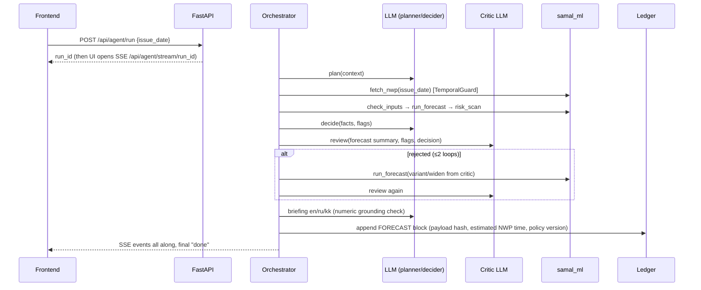

# ARCHITECTURE: design notes & decisions (read PROJECT_PLAN §4–6 first)

## Agent run sequence

## Recalculation ("when input data is updated")
Each target hour is forecast twice in the replay: day-ahead (lead 24–47, older runs K=2/3) and intraday by the next issue (lead 1–23, K=1/2).
`/api/agent/recalc` recomputes overlapping hours with the newest available lead-days, `forecast_diff()` → if material → `REVISION` block.
In a live deployment the trigger is a scheduler polling Open-Meteo for a new model run (every 6 h).

## Decisions (mini-ADRs)
| Decision | Why |
|---|---|
| Open-Meteo Previous Runs API | Free, no key, multi-model, fixed lead-time-offset archive; it does not expose exact source release timestamps |
| Configured latency 8 h in the lead-day rule | Conservative policy margin, not measured provider delay or a guarantee of release-time availability |
| scikit-learn HistGradientBoosting (not LightGBM/XGBoost) | Native quantile loss + NaN handling, no libomp install issues on Macs, fast enough |
| Isotonic power curve + MOS + GBM hybrid | Physics prior makes the model robust with only ~2 years of NWP; GBM learns local corridor effects |
| Conformal calibration | Empirical interval adjustment; report held-out coverage rather than a universal guarantee |
| LLM for decisions/explanations only | Numbers stay deterministic and testable; LLM failure never breaks forecasting |
| Hash-chain ledger | Tamper-evidence for anchored payloads and recorded offset-policy arithmetic; no claim of provider release-time proof |
| Deterministic state machine (no LangGraph) | Fewer dependencies, full control over events and fallbacks in a 5-hour build |
| SSE (not WebSockets) | One-way stream is all we need; trivial in FastAPI & browser |
| Caches committed to git | Judges reproduce offline and without keys (rule 5.6.6) |

Every NWP CSV cache chunk has a sidecar manifest with its request URL/parameters, date range, artifact SHA-256,
policy version, and explicit `source_release_time_verified:false`. New fetches record retrieval time and response
headers; older committed chunks have `retrieved_at:null`, and their reconstructed request URL is marked as such rather
than presented as a captured original HTTP request.
Old ledger blocks remain anchored unchanged and are reported as `legacy_policy_evidence`; new blocks record
`previous-runs-offset-v1` and the estimated initialization time separately from the backward-compatible field.
New blocks also hash the full immutable forecast file in addition to the backward-compatible row hash; legacy blocks
retain row-only hash coverage.
